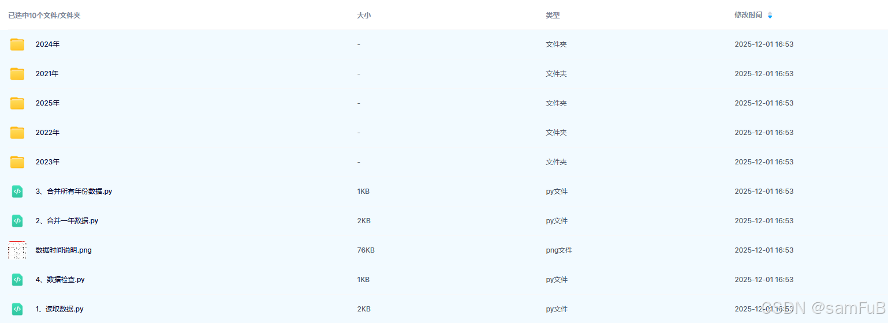
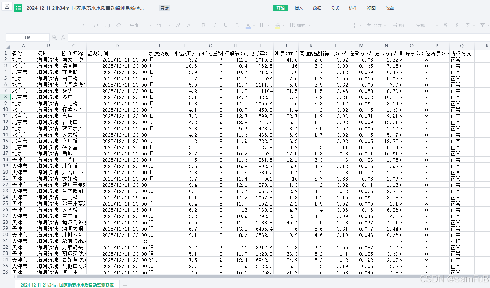
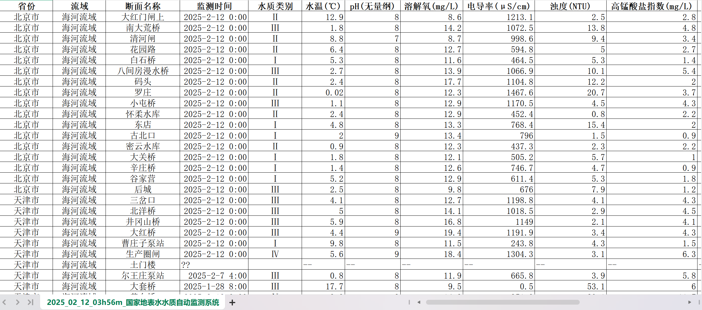
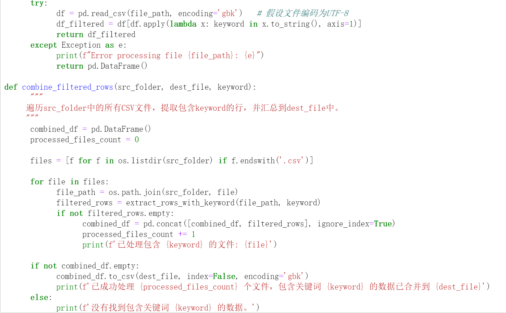

# Data Set - National Controlled Groundwater Quality Monitoring Data (2021-2025)

730MB
In this article, we will delve into a dataset containing groundwater quality monitoring data from 2021 to 2025 for the national control. This dataset meticulously records various monitoring 
indicators of surface water quality in our country, serving as crucial data for water environment research and analysis.
Groundwater quality monitoring serves as the core link between the current state of water environments, management actions, and ecological safety. Its importance spans multiple dimensions, including 
livelihood protection, ecological conservation, and social governance;
Moreover, the standardized and longitudinal data generated by monitoring are fundamental for promoting innovation in environmental science and related disciplines.
As the core component of China's surface water environment quality monitoring system, national control over groundwater quality monitoring is planned, deployed, and implemented by the state. It 
provides authoritative data support for China's water environment management, pollution prevention and control, and decision-making formulations.
Therefore, we have organized and shared the national controlled groundwater quality monitoring data for the years 2021-2025, including station monitoring data, station coordinates, and station shp 
point data among others.
I. Data Introduction
III. Data Overview
1. National Controlled Groundwater Quality Monitoring Data - File Overview

## Images

Here is a pay link on Stripe ( https://buy.stripe.com/3cs8yP7sY87d0vu9AB ). Please contact me lonlonago@foxmail.com after funding $89, and I will send you a complete data files , thank you!

